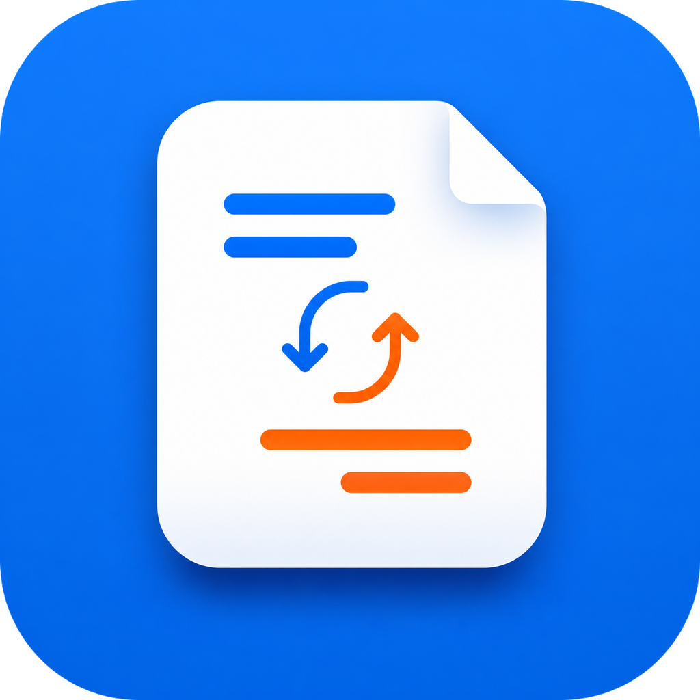

<div align="center">
  

  <h1>BabelDOC Desktop</h1>

  <p><strong>保留版式的智能 PDF 翻译桌面工作台</strong></p>
  <p>面向论文、报告、手册与长文档，在一个原生桌面界面中完成模型配置、批量翻译、进度跟踪和结果管理。</p>

  <p>
    <a href="https://github.com/ChenjieXu/babeldoc-desktop/releases/latest"></a>
    <a href="https://github.com/ChenjieXu/babeldoc-desktop/actions/workflows/release.yml"></a>
    <a href="https://babeldoc-desktop.readthedocs.io/"></a>
    <a href="https://www.python.org/"></a>
    <a href="LICENSE"></a>
    
  </p>

  <p>
    <a href="https://github.com/ChenjieXu/babeldoc-desktop/releases/latest"><strong>下载最新版本</strong></a>
    ·
    <a href="https://babeldoc-desktop.readthedocs.io/"><strong>在线文档</strong></a>
    ·
    <a href="https://github.com/ChenjieXu/babeldoc-desktop/issues"><strong>问题反馈</strong></a>
  </p>
</div>

<br />

<p align="center">
  
</p>

## 产品定位

BabelDOC Desktop 是 [BabelDOC](https://github.com/funstory-ai/BabelDOC) 的跨平台桌面客户端。它把高频任务选项放在主工作台，将凭据、兼容性、OCR 与性能设置收纳到独立配置页，让普通 PDF 翻译保持简单，同时保留处理复杂文档的控制能力。

| 能力 | 说明 |
| --- | --- |
| 保留文档结构 | 面向文本、公式、图表和复杂页面布局，减少普通文本翻译对版式的破坏 |
| 批量任务 | 一次添加多个 PDF，统一选择语言、模型、页面范围和输出方式 |
| 双语与单语输出 | 支持双语 PDF、单语 PDF，以及原文/译文页面交替排版 |
| 多模型接入 | 支持 OpenAI、DeepSeek、智谱 GLM、Claude、Ollama 和自定义兼容接口 |
| 术语增强 | 支持自动术语提取和一个或多个 CSV 术语表 |
| 可恢复的长任务 | 显示实时进度、错误与结果，并提供协作式取消，避免强制中断输出 |
| 本地配置 | 模型配置和 API Key 保存在当前用户的本机配置目录中 |

## 快速开始

### 下载桌面应用

从 [GitHub Releases](https://github.com/ChenjieXu/babeldoc-desktop/releases/latest) 下载与你的系统和架构匹配的压缩包：

| 平台 | 架构 | 构建产物 |
| --- | --- | --- |
| macOS | Apple Silicon | `macos-arm64.zip` |
| macOS | Intel | `macos-x64.zip` |
| Windows | x64 | `windows-x64.zip` |
| Linux | x64 | `linux-x64.tar.gz` |

> [!NOTE]
> 当前公开构建未使用 Apple Developer ID 或 Windows Authenticode 证书。首次启动时，操作系统可能显示未知开发者或 SmartScreen 提示。请只从本仓库的正式 Release 下载，并使用 `SHA256SUMS.txt` 校验文件完整性。

### 从源码运行

需要 Python 3.10 或更高版本，并建议使用 [uv](https://docs.astral.sh/uv/) 管理环境。

```bash
git clone https://github.com/ChenjieXu/babeldoc-desktop.git
cd babeldoc-desktop
uv sync --frozen --extra dev
uv run --frozen --extra dev python run.py
```

第一次启动后，在右上角 **设置 → 模型与服务** 中添加模型和 API Key，然后返回主工作台添加 PDF。

## 工作方式

1. **添加文档**：拖入 PDF 或批量选择文件。
2. **确认任务**：选择语言、模型、页面范围、输出模式和双语排版。
3. **增强术语**：按需启用自动提取或添加 CSV 术语表。
4. **开始翻译**：在任务状态区查看进度、取消任务或定位错误。
5. **打开结果**：翻译完成后直接查看输出文件及其所在位置。

未设置自定义输出目录时，结果默认保存在原 PDF 所在目录。

## 文档

完整文档托管在 [Read the Docs](https://babeldoc-desktop.readthedocs.io/)。

| 指南 | 内容 |
| --- | --- |
| [快速开始](https://babeldoc-desktop.readthedocs.io/en/latest/getting-started/) | 下载、源码运行和第一次模型配置 |
| [模型与设置](https://babeldoc-desktop.readthedocs.io/en/latest/configuration/) | 服务商、输出、OCR、兼容性和高级选项 |
| [翻译工作流](https://babeldoc-desktop.readthedocs.io/en/latest/translation/) | 页面范围、术语表、任务状态与输出类型 |
| [常见问题](https://babeldoc-desktop.readthedocs.io/en/latest/troubleshooting/) | 系统安全提示、启动、路径和日志排查 |
| [安全与隐私](https://babeldoc-desktop.readthedocs.io/en/latest/security/) | API Key 存储、权限和数据处理边界 |
| [开发指南](https://babeldoc-desktop.readthedocs.io/en/latest/development/) | 架构、测试、打包和文档构建 |

## 开发

```bash
# 静态检查
uv run --frozen ruff check .

# 测试
QT_QPA_PLATFORM=offscreen \
  uv run --frozen python -m unittest discover -s tests -p "test_*.py" -v

# PyInstaller 打包
uv run --frozen --extra dev python build.py
```

项目采用单向依赖：

```text
UI → Stores → Services → Models
```

更完整的开发说明见[开发文档](https://babeldoc-desktop.readthedocs.io/en/latest/development/)。

## 安全说明

API Key 当前保存在用户配置文件中，不由系统钥匙串托管。POSIX 系统会将配置目录和文件权限分别收紧为 `0700` 和 `0600`。请保护好用户账户、配置目录、日志和备份，不要在公开 Issue 中粘贴凭据或敏感文档内容。

## 参与贡献

欢迎通过 [Issues](https://github.com/ChenjieXu/babeldoc-desktop/issues) 报告问题或讨论需求。提交 Pull Request 前请确保：

- 变更范围清晰，并附带必要的测试；
- Ruff 与全部 unittest 检查通过；
- 用户行为、配置或界面发生变化时同步更新文档；
- 不提交 API Key、真实用户文档、翻译结果或本地配置。

## 许可证与致谢

本项目采用 [AGPL-3.0-only](LICENSE) 许可证。

- [BabelDOC](https://github.com/funstory-ai/BabelDOC)：PDF 翻译核心库
- [PySide6](https://doc.qt.io/qtforpython/)：Qt for Python 桌面框架
- [uv](https://docs.astral.sh/uv/)：Python 环境与依赖管理

<div align="center">
  如果 BabelDOC Desktop 对你有帮助，欢迎点亮 Star。
</div>
