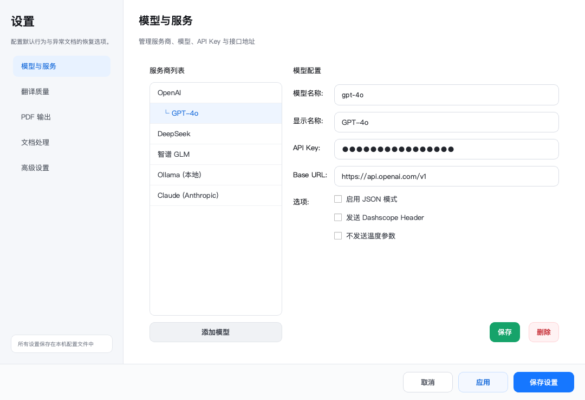

# 模型与设置

BabelDOC Desktop 将高频任务选项放在主工作台，将凭据、默认值和异常文档恢复选项放在设置窗口。

<figure class="product-shot" markdown>
  
</figure>

## 主工作台选项

| 选项 | 作用 |
| --- | --- |
| 源语言 / 目标语言 | 指定当前任务的语言方向 |
| 翻译模型 | 选择已配置的服务商和模型 |
| 页面范围 | 留空翻译全部页面，也可填写 `1-5, 8` |
| 输出模式 | 双语 + 单语、仅双语或仅单语 |
| 双语排版 | 标准双语或原文/译文页面交替 |
| 自动提取术语 | 为当前任务启用术语抽取 |
| CSV 术语表 | 添加一个或多个外部术语表 |

## 设置页面

### 模型与服务

管理 OpenAI、DeepSeek、智谱 GLM、Ollama、Claude 等服务商的模型名称、API Key、Base URL 和兼容选项。

### 翻译质量

设置请求节奏、最小文本长度、自动术语提取和自定义系统提示词。

### PDF 输出

设置默认输出类型、水印策略、双语顺序和兼容模式。

### 文档处理

包含 OCR、富文本、公式、字体、短行拆分与内容保护等恢复选项。普通文档通常不需要修改。

### 高级设置

包含工作线程、布局识别服务、输出目录和工作目录。错误配置可能影响性能或输出位置。

## 配置文件位置

- Windows：`%APPDATA%/babeldoc-desktop/settings.json`
- macOS / Linux：`~/.config/babeldoc-desktop/settings.json`

未指定输出目录时，翻译结果默认保存在原 PDF 所在目录。
