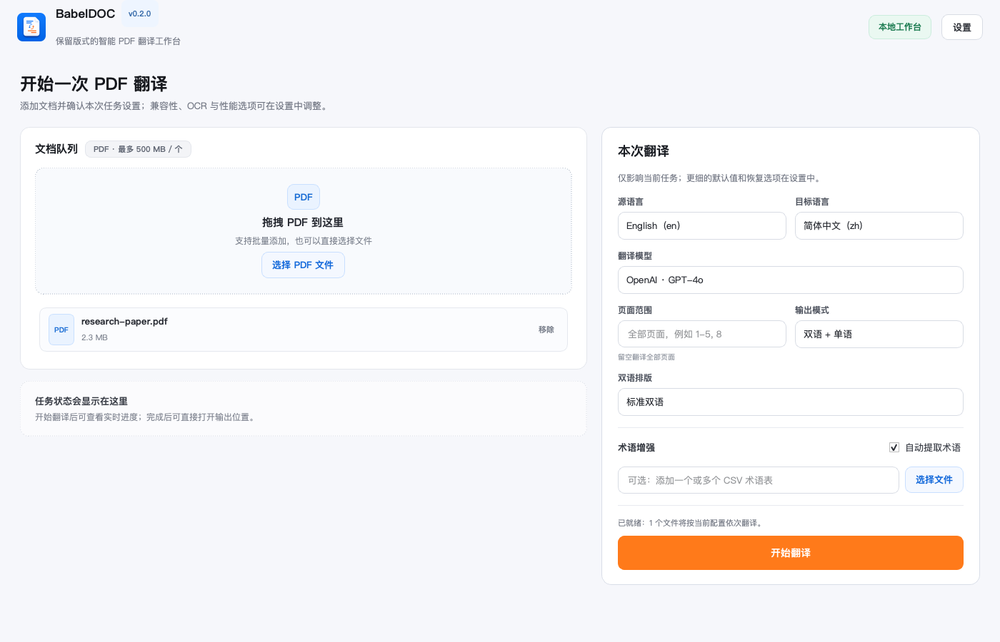

# BabelDOC Desktop

  保留原文版式、公式与阅读结构的智能 PDF 翻译桌面工作台。面向论文、报告、手册和长文档，支持自带模型密钥、本地配置与跨平台运行。

[下载最新版本](https://github.com/ChenjieXu/babeldoc-desktop/releases/latest){ .md-button .md-button--primary }
[查看快速开始](getting-started.md){ .md-button }

<figure class="product-shot" markdown>
  
</figure>

## 为什么选择 BabelDOC Desktop

-   **面向长文档**

    批量添加 PDF，选择页面范围，并在一个任务中输出双语与单语版本。

-   **保留阅读结构**

    基于 BabelDOC 处理文本、公式、图表和页面布局，减少普通文本翻译破坏版式的问题。

-   **模型选择自由**

    支持 OpenAI、DeepSeek、智谱 GLM、Claude、Ollama 以及自定义兼容接口。

-   **桌面端可控**

    设置和 API Key 保存在本机；进度、错误和输出位置在任务界面中持续可见。

## 文档导航

| 目标 | 文档 |
| --- | --- |
| 安装并完成第一次翻译 | [快速开始](getting-started.md) |
| 配置模型、输出和高级选项 | [模型与设置](configuration.md) |
| 理解页面范围、术语表和输出文件 | [翻译工作流](translation.md) |
| 处理系统安全提示或启动问题 | [常见问题](troubleshooting.md) |
| 了解 API Key 的本地存储方式 | [安全与隐私](security.md) |

!!! note "签名状态"
    当前公开构建未使用 Apple Developer ID 或 Windows Authenticode 证书。首次启动时，操作系统可能显示未知开发者或 SmartScreen 提示。
